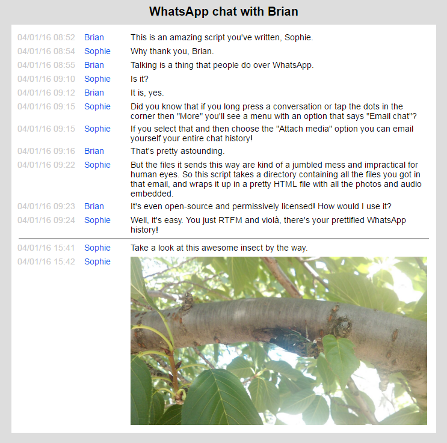

# Summary

WhatsApp offers an "Email chat" feature, which emails your chat history as a mess of email attachments not so great for human-readability. Pretty-WhatsApp is a script for Python 2.7 which generates an easy-on-the-eyes webpage from the jumble of files attached to those emails received using this feature. 

Please note that your browser may not support embedding of all media attachments WhatsApp includes in your emailed archive, and this may detract from your chat history viewing experience.

Pretty-WhatsApp is released under the [zlib/libpng license](license.txt).

# Usage

To get an email with your chat history and attached files, tap the three dots in the top right corner of one of your chats, tap "More >", then tap "Export chat". A popup will appear prompting you to export either with or without media. For the best results using the Pretty-WhatsApp tool, you should tap the "INCLUDE MEDIA" option in this popup. When you are prompted on how to share these files, you can select your email app and send the email with its attachments to your own email address. To use Pretty-WhatsApp, you will need to take all of the files that are sent as attachments in such an email and put them into one directory.

_Old instructions which were for an old version of the app, preserved here for posterity:_ To acquire an email with your chat history and attached files, select "Email chat" in the menu appearing when long pressing a conversation, or when tapping the dots while viewing a conversation and selecting "More". This script is intended for emailed chats sent with the "Attach media" option. After selecting the option, you'll be prompted to send an email. To use Pretty-WhatsApp you should view this sent email on your computer and download all the attachments into one directory.

You can then run the script like this, which will cause a `pretty-whatsapp.html` file to be generated and written to the input directory given.

``` text
python pretty-whatsapp.py -i path/to/downloaded/files
```

The script supports some additional, optional arguments:

* `-o` Set the location of the outputted HTML file. (Default: `[input path]/pretty-whatsapp.html`)
* `-c` Set the CSS file used to style the outputted page. (Default: `pretty-whatsapp.css`)
* `-t` Set the number of seconds between consecutive messages before a divider is inserted. (Default: `18000`)
* `-f` Set how dates are formatted in the outputted HTML. (Default: `%d/%m/%y %H:%M`)
* `-y` Silence requests to confirm before overwriting existing files.

# Example

[View example webpage](example-archive/pretty-whatsapp.html)

You could try generating this page on your own by running `python pretty-whatsapp.py -i example-archive` from the repository's root directory.

``` text
client-227:whatsapp pineapple$ python pretty-whatsapp.py -i example-archive/
Pretty-WhatsApp 1.0.0 by Sophie Kirschner
Reading chat log from input directory "example-archive/".
Parsing chat messages.
Generating output HTML from messages.
Copying CSS to path "example-archive/pretty-whatsapp.css".
Writing HTML to path "example-archive/pretty-whatsapp.html".
All done!
```


